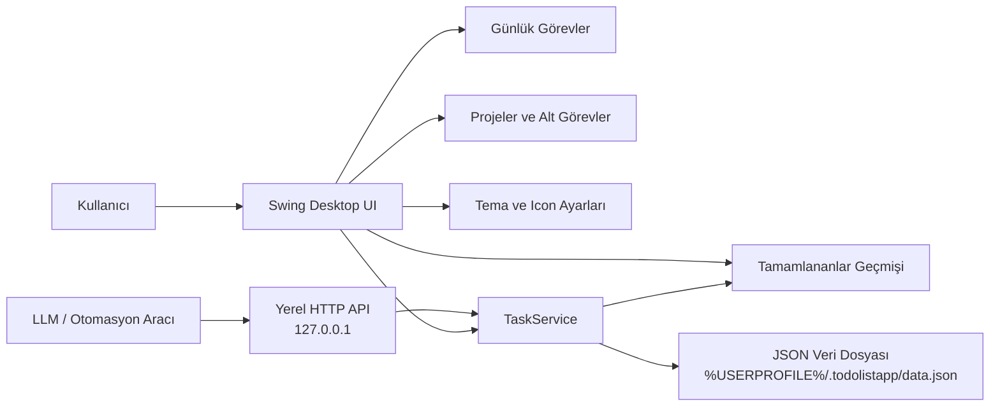

# ToDoListApp

ToDoListApp, günlük rutinleri ve proje işlerini aynı masaüstü uygulamasında yönetmek için hazırlanmış Java tabanlı bir görev uygulamasıdır. Günlük görevler tekrar kurallarıyla yenilenebilir; proje görevleri alt görevlere ayrılarak divide and conquer mantığıyla takip edilebilir. Uygulama ayrıca yerel bir LLM API açar; böylece başka araçlar görev oluşturabilir, listeleyebilir ve tamamlayabilir.



## Özellikler

- Günlük görevler ve proje görevleri ayrı ekranlarda yönetilir.
- Görev oluşturma, güncelleme, silme, tamamlama ve deadline ekleme desteklenir.
- Deadline gün, ay, yıl, saat ve dakika seçicileriyle girilir; saat boş bırakılırsa seçilen tarihin ertesi günü `00:00` kullanılır.
- Günlük görevlerde tekrar seçenekleri vardır: her gün, haftanın belirli günleri veya her X günde bir.
- Görevlerin altında alt görev açılabilir; alt görevler branch çizgileriyle ana göreve bağlı görünür.
- Görev kartları yumuşak köşeli, pürüzsüz ve özelleştirilebilir renklidir.
- Proje görevleri tamamlandığında tamamlananlar bölümüne taşınıp taşınmayacağı sorulur.
- Projeler komple tamamlanabilir; proje ve içindeki görevler tamamlananlar geçmişine aktarılır.
- Günlük görevler gün içinde tamamlanmış görünür; gün değiştiğinde tamamlananlar geçmişine otomatik taşınır.
- Tamamlanan görevler tarih ve saat bilgisiyle tutulur, en yeni tamamlanan en üstte görünür.
- LLM ve otomasyon araçları için token korumalı yerel HTTP API bulunur.
- Ayarlar ekranından arka plan rengi, görev rengi, tamamlanan görev rengi, panel rengi ve exe icon dosyası seçilebilir.
- `jpackage` ile masaüstü kısayolu ve `ToDoListApp.exe` içeren app-image üretilebilir.

## Gereksinimler

- Java JDK 17 veya üzeri
- Windows PowerShell
- Masaüstü exe/app-image üretmek için JDK içindeki `jpackage`

Kontrol:

```powershell
java -version
javac -version
jpackage --version
```

## Kurulum

Repoyu klonlayın:

```powershell
git clone https://github.com/KaanYunak/ToDoListApp.git
cd ToDoListApp
```

Uygulamayı derleyin:

```powershell
powershell.exe -NoProfile -ExecutionPolicy Bypass -File .\scripts\build.ps1
```

Uygulamayı başlatın:

```powershell
powershell.exe -NoProfile -ExecutionPolicy Bypass -File .\scripts\run.ps1
```

Smoke testi çalıştırın:

```powershell
powershell.exe -NoProfile -ExecutionPolicy Bypass -File .\scripts\test.ps1
```

## Masaüstü Exe

App-image ve masaüstü kısayolu üretmek için:

```powershell
powershell.exe -NoProfile -ExecutionPolicy Bypass -File .\scripts\build-desktop-app.ps1
```

Çıktı:

```text
build\desktop\ToDoListApp\ToDoListApp.exe
```

Script ayrıca masaüstüne `ToDoListApp.lnk` kısayolu oluşturur. Exe, yanındaki runtime dosyalarıyla birlikte çalıştığı için `build\desktop\ToDoListApp` klasörünü silmeyin.

Özel icon ile üretmek için `.ico` dosyası verin:

```powershell
powershell.exe -NoProfile -ExecutionPolicy Bypass -File .\scripts\build-desktop-app.ps1 -IconPath "C:\icons\todo.ico"
```

Ayarlar ekranında icon yolu kaydedildiyse script parametre verilmeden de bu yolu okumaya çalışır.

## Kullanım

Sol menüden `Günlük Görevler`, `Projeler`, `Tamamlananlar`, `LLM API` ve `Ayarlar` ekranlarına geçilir.

Günlük görev eklerken tekrar kuralı seçilebilir. `WEEKDAYS` seçildiğinde haftanın istenen günleri işaretlenir. `EVERY_X_DAYS` seçildiğinde aralık değeri girilir.

Projeler ekranında proje oluşturabilir, proje içine görev ekleyebilir ve her görevin altına alt görev açabilirsiniz. `Projeyi tamamla` düğmesi proje ve içindeki görevleri tamamlananlar geçmişine taşır.

Ayarlar ekranında renkleri `#RRGGBB` formatında girebilir veya renk seçiciden seçebilirsiniz. Icon alanı `.ico` dosyasını saklar ve desktop app üretim scripti tarafından kullanılabilir.

## LLM API Bağlama

Uygulama açıldığında yerel API `127.0.0.1` üzerinde başlar. Port ve token uygulamadaki `LLM API` ekranında görünür. `Adres`, `Token` ve örnek bağlantı kodu kopyalama düğmeleriyle alınabilir.

LLM aracına şu bilgileri verin:

- Base URL: uygulamadaki `LLM API` ekranında görünen adres, örneğin `http://127.0.0.1:4567`
- Header adı: `X-API-Token`
- Header değeri: uygulamadaki token

PowerShell ile hızlı test:

```powershell
$headers = @{ "X-API-Token" = "TOKEN" }
Invoke-RestMethod "http://127.0.0.1:4567/api/tasks" -Headers $headers
```

Görev oluşturma:

```powershell
$body = @{
  title = "Sabah planını yap"
  category = "DAILY"
  deadline = "2026-06-24T00:00:00"
  recurrence = @{
    type = "DAILY"
  }
} | ConvertTo-Json -Depth 5

Invoke-RestMethod "http://127.0.0.1:4567/api/tasks" -Method Post -Headers @{
  "X-API-Token" = "TOKEN"
  "Content-Type" = "application/json"
} -Body $body
```

Proje tamamlama:

```powershell
$body = @{ completed = $true } | ConvertTo-Json
Invoke-RestMethod "http://127.0.0.1:4567/api/projects/PROJECT_ID" -Method Patch -Headers @{
  "X-API-Token" = "TOKEN"
  "Content-Type" = "application/json"
} -Body $body
```

## API Uçları

- `GET /health`
- `GET /api/tasks`
- `GET /api/tasks?category=DAILY`
- `GET /api/tasks?category=PROJECT&projectId=PROJECT_ID`
- `POST /api/tasks`
- `PATCH /api/tasks/{id}`
- `DELETE /api/tasks/{id}`
- `GET /api/projects`
- `POST /api/projects`
- `PATCH /api/projects/{id}`
- `DELETE /api/projects/{id}`
- `GET /api/completed`

## Veri Dosyası

Varsayılan veri dosyası:

```text
%USERPROFILE%\.todolistapp\data.json
```

Farklı bir veri dosyasıyla çalıştırmak için:

```powershell
java -Dtodolist.data=C:\temp\todolist-data.json -jar .\build\ToDoListApp.jar
```
